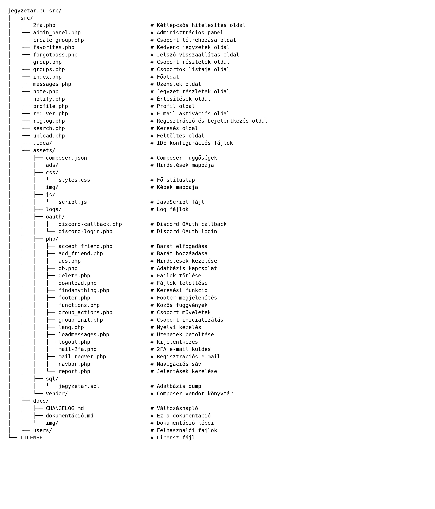

<h1 align="center">
"Schola Europa Akadémia" Technikum, Gimnázium és Alapfokú Művészeti Iskola  
a Magyarországi Metodista Egyház fenntartásában
</h1>

<p align="center"></p>

<p align="center"><strong>SZOFTVERFEJLESZTŐ ÉS -TESZTELŐ</strong></p>

<p align="center">5 0613 12 03</p>

<p align="center"><strong>Dokumentáció</strong></p>

<p align="center">
Készítette: <br />
Baranyi Norbert 14/B <br />
Csontos Kincső Anasztázia 14/A <br />
Szekeres Levente 14/A
</p>

<p align="center"><strong>2026</strong></p>

<div style="page-break-before: always;"></div>
0. [Dokumentum adatai](#dokumentum-adatai)

1. [Bevezetés](#1-bevezetés)
   - 1.1. [A Projekt Célja](#11-a-projekt-célja)
   - 1.2. [Főbb Funkciók](#12-főbb-funkciók)
   - 1.3. [Technológiai Stack](#13-technológiai-stack)
   - 1.4. [Fogalomtár (Glossary)](#14-fogalomtár-glossary)

2. [Rendszerarchitektúra](#2-rendszerarchitektúra)
   - 2.1. [Magas Szintű Architektúra](#21-magas-szintű-architektúra)
   - 2.2. [Komponensek](#22-komponensek)
   - 2.3. [Adatbázis Séma](#23-adatbázis-séma)

3. [Frontend Architektúra](#3-frontend-architektúra)
   - 3.1. [Komponens Hierarchia](#31-komponens-hierarchia)
   - 3.2. [Állapotkezelés](#32-állapotkezelés)
   - 3.3. [Routing](#33-routing)
   - 3.4. [UI/UX Design](#34-uiux-design)

4. [Backend Architektúra](#4-backend-architektúra)
    - 4.1. [Backend funkciók és felelősségek](#41-backend-funkciók-és-felelősségek)
        - 4.1.1. [Felhasználókezelés és autentikáció](#411-felhasználókezelés-és-autentikáció)
        - 4.1.2. [Jogosultságok és szerepkörök](#412-jogosultságok-és-szerepkörök)
        - 4.1.3. [Jegyzetek kezelése](#413-jegyzetek-kezelése-crud--metaadat)
        - 4.1.4. [Fájlfeltöltés és validáció](#414-fájlfeltöltés-és-validáció)
        - 4.1.5. [Közösségi funkciók](#415-közösségi-funkciók)
        - 4.1.6. [Jelentés és moderáció](#416-jelentés-és-moderáció-report-rendszer)
        - 4.1.7. [Profil és testreszabás](#417-profil-és-testreszabás-css-kérelmek)
        - 4.1.8. [Üzenetek, barátok, értesítések](#418-üzenetek-barátok-értesítések)
        - 4.1.9. [Csoport funkciók](#419-csoport-funkciók)
        - 4.1.10. [Lokalizáció](#4110-lokalizáció-i18n)
        - 4.1.11. [Adatbázis hozzáférési segédek és biztonság](#4111-adatbázis-hozzáférési-segédek-és-biztonság)
    - 4.2. [Adatbázis kapcsolat](#42-adatbázis-kapcsolat)
    - 4.3. [Fájlkezelés](#43-fájlkezelés)

5. [Deployment](#5-deployment)
    - 5.1. [Környezetek](#51-környezetek)
    - 5.2. [Fejlesztői környezet](#52-fejlesztői-környezet-development)
    - 5.3. [Kód commit és push](#53-kód-commit-és-push)
    - 5.4. [Code review](#54-pull-request-és-code-review)
    - 5.5. [Hibaelhárítás](#55-hibaelhárítás)

6. [Biztonság](#6-biztonság)
    - 6.1. [Autentikáció](#61-autentikáció)
    - 6.2. [Jogosultságkezelés (RBAC)](#62-jogosultságkezelés-rbac)

7. [Tesztelés](#6-tesztelés)
    - 7.1. [Egység Tesztek](#71-egység-tesztek)
    - 7.2. [Manuális Tesztek](#72-manuális-tesztek)

8. [Felhasználói Dokumentáció](#8-felhasználói-dokumentáció)
       - 8.1. [Elérés / Használatba vétel](#81-elérés--használatba-vétel)
       - 8.2. [Használat](#82-használat)
           - 8.2.1. [Regisztráció](#821-regisztráció)
           - 8.2.2. [Bejelentkezés + 2FA](#822-bejelentkezés--2fa)
           - 8.2.3. [Jegyzet keresése és letöltése](#823-jegyzet-keresése-és-letöltése)
           - 8.2.4. [Jegyzet feltöltése](#824-jegyzet-feltöltése)
           - 8.2.5. [Kommentelés, értékelés, kedvencek](#825-kommentelés-értékelés-kedvencek)
           - 8.2.6. [Profilkezelés](#826-profilkezelés)
           - 8.2.7. [Barátok hozzáadása és üzenetek](#827-barátok-hozzáadása-és-üzenetek)
       - 8.3. [Weben belüli navigáció (Oldaltérkép)](#83-weben-belüli-navigáció-oldaltérkép)
       - 8.4. [Biztonsági Tippek](#84-biztonsági-tippek)
       - 8.5. [Gyakori problémák (FAQ)](#85-gyakori-problémák-faq)

9. [Fejlesztői Dokumentáció](#9-fejlesztői-dokumentáció)
       - 9.1. [Fejlesztői Környezet Beállítása](#91-fejlesztői-környezet-beállítása)
       - 9.2. [Verziókezelési Stratégia](#92-verziókezelési-stratégia)
           - 9.2.1. [Verziószám felépítése](#921-verziószám-felépítése)
           - 9.2.2. [Fejlesztési (beta) állapot jelölése](#922-fejlesztési-beta-állapot-jelölése)
           - 9.2.3. [Átmenet végleges verzióra](#923-átmenet-végleges-verzióra)
           - 9.2.4. [Verziózás a CHANGELOG-ban](#924-verziózás-a-changelog-ban)
           - 9.2.5. [Dátumformátum szabályok](#925-dátumformátum-szabályok)
           - 9.2.6. [Verziókezelés és Git kapcsolata](#926-verziókezelés-és-git-kapcsolata)
           - 9.2.7. [Összefoglalás](#927-összefoglalás)
       - 9.3. [FájlStruktúra](#93-fájlstruktúra)
       - 9.4. [Fejlesztői eszközök, script-ek és refaktorok](#94-fejlesztői-eszközök-script-ek-és-refaktorok)
       - 9.5. [Konfiguráció](#95-konfiguráció)
       - 9.6. [Fő folyamatok](#96-fő-folyamatok)
       - 9.7. [Security checklist (dev)](#97-security-checklist-dev)
       - 9.8. [Debug / logging](#98-debug--logging)
       - 9.9. [Változásnapló (Changelog)](#99-változásnapló-changelog)
       - 9.10. [Dokumentáció karbantartás](#910-dokumentáció-karbantartás)

10. [API Dokumentáció](#10-api-dokumentáció)

11. [Jövőbeli Tervek](#11-jövőbeli-tervek)
        - 11.1. [Kollaboratív tanulási eszközök](#111-kollaboratív-tanulási-eszközök)
        - 11.2. [API és harmadik fél integrációk](#112-api-és-harmadik-fél-integrációk)
        - 11.3. [Big data analitika](#113-big-data-analitika)
        - 11.4. [AI-alapú keresés és javaslatok](#114-ai-alapú-keresés-és-javaslatok)
        - 11.5. [Gamifikáció](#115-gamifikáció)
        - 11.6. [Mobil Applikáció](#116-mobil-applikáció)
        - 11.7. [Interaktív tesztek](#117-interaktív-tesztek)

12. [Ki mit készített?](#12-ki-mit-készített)
        - 12.1. [Baranyi Norbert](#121-baranyi-norbert)
        - 12.2. [Csontos Kincső Anasztázia](#122-csontos-kincső-anasztázia)
        - 12.3. [Szekeres Levente](#123-szekeres-levente)
        - 12.4. [Szekeres Levente & Baranyi Norbert](#124-szekeres-levente--baranyi-norbert)

13. [Licensz](#13-licensz)

<div style="page-break-before: always;"></div>

## Dokumentum adatai

| Tulajdonság | Érték |
|--------------------------|----------------------------------------|
| **Projekt neve**         | Jegyzetár                              |
| **Dokumentum típusa**    | Fejlesztői + felhasználói dokumentáció |
| **Dokumentum azonosító** | JEGYZETAR-DOKU-2026-01                 |
| **Verzió**               | 1.0.0                                  |
| **Kiadás dátuma**        | TBD                                    |
| **Utolsó frissítés**     | 2026-01-15                             |
| **Állapot**              | Draft                                  |
| **Célközönség**          | Diákok, tanárok, fejlesztők            |
| **Repository**           | doomhyena/jegyzetar.eu-src             |
| **Célplatform**          | Web (reszponzív)                       |
| **Min. PHP**             | 8.2+                                   |
| **Támogatott böngészők** | Chrome, Firefox, Edge (friss)          |
| **Kapcsolat**            | info@jegyzetar.hu                      |

**Verziózás:** SemVer (major.minor.patch)  
**Megjegyzés:** A dokumentáció a projekt aktuális állapotát tükrözi, a változásokat a CHANGELOG rögzíti.

<div style="page-break-before: always;"></div>

## 1. Bevezetés

### 1.1. A Projekt Célja

A **Jegyzetár** egy modern, közösségi alapú, oktatássegítő platform, amely lehetővé teszi a diákok számára, hogy egyszerűen és biztonságosan megosszák egymással jegyzeteiket, segédanyagaikat és tanulást támogató dokumentumaikat. A projekt célja, hogy:

* **Kik használják?**
Diákok, tanárok és oktatók, akik megosztanák egymással az oktatási anyagokat.

* **Gyors és kényelmes fájlmegosztást biztosítson tanulóknak**

  - A felhasználók könnyedén feltölthetnek, kereshetnek és letölthetnek jegyzeteket
  - A platform reszponzív kialakítása biztosítja a mobilbarát használatot
  - Az egyszerű kezelőfelület csökkenti az informatikai tudás iránti igényt

* **Rendszerezett és kereshető tananyagbázist hozzon létre**

  - Tantárgyak, évfolyamok és dokumentumtípusok szerint kategorizál
  - Kulcsszavas keresés és szűrés segíti a gyors anyagkeresést
  - Előnézeti kép vagy rövid leírás segít a tartalom gyors azonosításában

* **Támogassa a közösségi tanulást**

  - A felhasználók értékelhetik, kommentelhetik a jegyzeteket
  - A rendszer kiemeli a legnépszerűbb vagy legjobbra értékelt anyagokat


---

### 1.2. Főbb Funkciók

A Jegyzetár rendszer az alábbi kulcsfunkciókat biztosítja:

### Fájlfeltöltés és -kezelés

- Jegyzetek és segédanyagok feltöltése PDF, DOCX, MP4 formátumban
- Automatikus kategorizálás tantárgy és dokumentumtípus szerint
- Előnézeti kép generálása (PDF első oldal, képek)

### Felhasználói felület

- Regisztráció és bejelentkezés (alap és "OAuth")
- Egyéni irányítópult a feltöltések, letöltések, értékelések követésére
- Mobilbarát és reszponzív dizájn

### Keresés és közösségi funkciók

- Kulcsszavas kereső és szűrő (tantárgy, értékelés alapján)
- Kommentelés, csillagozás
- Legnépszerűbb jegyzetek és új feltöltések kiemelése

### Adminisztráció és jogosultságok

- Admin felület a tartalmak, felhasználók és kategóriák kezeléséhez
- Feltöltések jelentése és moderálása
    - Admin eszközök kiterjesztése: Külön felület az egyedi profil CSS kérések kezelésére (jóváhagyás / elutasítás / archiválás), valamint a felhasználók és feltöltések részletes kezelése (törlés, szerkesztés, moderation logs).

### Profil egyedi CSS kérések
Bevezetésre került a felhasználói CSS kérelmek kezelése, amely a profil felületén megadható, de csak admin jóváhagyása után érvényesül. Az előnézet a felhasználói élményt javítja és nem ment a szerverre automatikusan.

### Admin jóváhagyási UI
Az admin panelben külön táblában listázhatók és jóváhagyhatók a CSS kérések; az elfogadott CSS archiválható és az előző állapot is visszaállítható.

### Frontend preview & safe background rules
A preview kliens oldali (style tag injektálás), a SAFE_BG_RULE szabály megakadályozza a background képek kellemetlen ismétlődését, és a preview idején a jobboldali panel rejtésre kerül, hogy az előnézet ne rontsa el az oldalt.

### Lokalizációs módosítások
A `t()` segédfüggvény és `lang.php` központi megoldással egy adatbázis-alapú fordítási rendszer lett bevezetve. A fordítások hiányzó kulcsait automatikusan lehet seed-elni. Fordítási kulcsok a `profiles`-hoz a 1543-as ID-tól készültek.

### SQL dump & seed eszközök
Hozzáadtuk a `clean_translations.py`, `translations_clean.sql`, `replace_translations_in_dump.py`, `repair_translations.sql` eszközöket, amelyek a dump-ok importjának biztonságát növelik (duplikált bejegyzések eltávolítása, ON DUPLICATE használata, táblák import sorrendje). A `repair_translations.sql` script automatikus backup-ot készít, majd törli a duplikátumokat és létrehozza a megfelelő UNIQUE indexet.

### Biztonsági javítások
A kód refaktorálásával `db_prepared()` használata javasolt a lekérdezésekhez, `require_once` és `function_exists` védelem bevezetésre került, a `Message()` segédfüggvény javítja az értesítések konzisztenciáját.

### 1.3. Technológiai Stack

A Jegyzetár fejlesztése során a következő technológiákat és eszközöket használtuk, amelyek mindegyike szabadon elérhető és bármilyen modern számítógépen telepíthető:

### Frontend
- **HTML5, CSS3, JavaScript**: Az alapvető webes technológiák a felhasználói felület kialakításához.
- **Bootstrap**: Reszponzív és mobilbarát dizájn gyors fejlesztéséhez.
- **jQuery**: Egyszerű DOM-manipulációk és AJAX-hívások kezelésére.

### Backend
- **PHP (8.2+)**: A szerveroldali logika és API-k implementálásához.

### Adatbázis
- **MySQL**: Relációs adatbázis-kezelő a felhasználói adatok, fájlok és egyéb információk tárolására.
- **phpMyAdmin**: Az adatbázis adminisztrációjához.

### Verziókezelés
- **Git**: Verziókövetés és csapatmunka támogatása.
- **GitHub**: Távoli repository a kód tárolására és megosztására.

### Egyéb eszközök
- **XAMPP**: Lokális fejlesztői környezet (Apache, MySQL, PHP) - ingyenesen letölthető bármely operációs rendszerre.
- **Visual Studio Code**: Kódszerkesztő a fejlesztéshez - ingyenes és cross-platform.
- **PHPStorm**: Integrált Fejlesztői Környezet a fejlesztéshez - fizetős verzió elérhető bármeély operációs rendszerre (opcionális).

### Felhasznált hardverek

#### Baranyi Norbert

-

#### Csontos Kincső Anasztázia

- **Laptop**: Lenovo LOQ 15A
- **CPU**: AMD Ryzen 5 7235HS
- **GPU**: NVIDIA GeForce RTX 3050 6GB Laptop GPU
- **RAM**: 16GB DDR5 4800 MHz
- **SSD**: 512GB NVMe SSD
- **OS**: Windows 11 Pro 64-bit

#### Szekeres Levente

-

### Hardver követelmények
A fejlesztési környezet bármilyen modern számítógépen futtatható. Minimális követelmények:
- **Operációs rendszer**: Windows 10/11, macOS 10.14+ vagy Linux (Ubuntu/Debian)
- **Processzor**: Modern többmagos CPU (pl. Intel i5, AMD Ryzen 5 vagy hasonló)
- **Memória**: Legalább 8GB RAM (ajánlott 16GB a jobb teljesítmény érdekében)
- **Tárhely**: Legalább 50GB szabad hely SSD-n a projekt fájlok és virtuális környezet számára
- **Grafikus kártya**: Integrált vagy dedikált GPU (nem kritikus, mivel webfejlesztésről van szó)

### 1.4. Fogalomtár (Glossary)

- **2FA:** Kétlépcsős hitelesítés, belépéskor e-mailben kapott kóddal.
- **OAuth:** Külső szolgáltatóval (pl. Discord) történő bejelentkezés.
- **Tag:** Kulcsszó címke a jegyzetek gyorsabb kereséséhez.
- **Moderáció:** Admin felügyelet (jelentések kezelése, tartalom törlés/szerkesztés).
- **Seed:** Kezdő (teszt) adatok betöltése adatbázisba.
- **Dump:** Adatbázis kimentés (.sql) importálható formában.


## 2. Rendszerarchitektúra

### 2.1. Magas Szintű Architektúra
A Jegyzetár egy háromrétegű architektúrát követ:
1. **Prezentációs réteg**: A felhasználói felület, amely a frontend technológiákra épül.
2. **Alkalmazásréteg**: A backend logika, amely PHP segítségével valósul meg.
3. **Adatbázis réteg**: A MySQL adatbázis, amely az összes adatot tárolja.

### 2.2. Komponensek
- **Frontend**: A felhasználói interakciók kezelése és az adatok megjelenítése.
- **Backend**: A logika és az adatbázis műveletek végrehajtása.
- **Adatbázis**: A felhasználói adatok, fájlok és metaadatok tárolása.

### 2.3. Adatbázis Séma

Az alábbi ábra a Jegyzetár adatbázis fő tábláit és azok kapcsolatait mutatja be:

[Hamarosan]

### Jogosultsági szintek (áttekintés)

- **Guest (vendég):** böngészés, keresés, nyilvános jegyzetek megtekintése/letöltése (ha engedélyezett).
- **User (felhasználó):** feltöltés, komment, értékelés, kedvencek, profil szerkesztés, barátok/üzenetek.
- **Admin:** moderáció (jelentések), felhasználók kezelése, tartalmak törlése/szerkesztése, CSS kérelmek jóváhagyása/elutasítása.

## 3. Frontend Architektúra

### 3.1. Komponens Hierarchia

### 3.2. Állapotkezelés

### 3.3. Routing

### 3.4. UI/UX Design
A Jegyzetár felhasználói felülete egyszerű és intuitív, a következő szempontokat figyelembe véve:
- **Reszponzív dizájn**: A platform minden eszközön jól használható.
- **Egyszerű navigáció**: Könnyen elérhető funkciók és tiszta menürendszer.
- **Konzisztens stílus**: Azonos színpaletta és tipográfia az egész alkalmazásban.

#### Frontend kiegészítések 

- A profiloldalhoz egy kliensoldali CSS előnézeti funkció került be: a felhasználó `profile.php` oldalon megadhat, és előnézhet egyedi CSS beállításokat. A preview csak kliensoldali stílus-injektálást használ és nem menti el automatikusan az adatbázisba.
- Biztonsági frontend szabályok: a preview megakadályozza a kedvezőtlen elrendezés-befolyásolást (jobboldali oszlop eltakarása preview alatt), illetve van egy `SAFE_BG_RULE` ami megakadályozza a háttér pattern (tiling) fokozott felvillanását.
- Üres CSS beküldésének megelőzése: kliens-oldali validáció, toast üzenet és szerveroldali fallback letakarítás, visszaállítási jelzés a felhasználó számára.

## 4. Backend Architektúra

### 4.1. Backend funkciók

A Jegyzetár backendje PHP alapon biztosítja az alkalmazás üzleti logikáját, a jogosultságkezelést, az adatbázis-műveleteket, valamint a fájlkezelést és az e-mail alapú folyamatokat.

#### 4.1.1. Felhasználókezelés és autentikáció

* **Regisztráció és belépés** (`reglog.php`)
* **E-mail aktiváció**: regisztráció után aktiváló link küldése és validálása
  *(mail-regver.php, reg-ver.php, `tokens` tábla)*
* **Kétlépcsős hitelesítés (2FA)**: belépés után e-mail kód küldése és ellenőrzése
  *(mail-2fa.php, 2fa.php, `2fa_codes` tábla)*
* **Vendég mód**: a főoldal böngészése bejelentkezés nélkül (korlátozott jogosultság)

#### 4.1.2. Jogosultságok és szerepkörök

* Guest / User / Admin jogosultsági szintek alkalmazása
* Admin funkciók elérése és védelme (moderáció, felhasználókezelés, CSS kérések)

#### 4.1.3. Jegyzetek kezelése (CRUD + metaadat)

* Jegyzetek listázása és részletek megjelenítése (`index.php`, `note.php`)
* Metaadatok kezelése (név, leírás, tantárgy, tag-ek)
* Letöltések kiszolgálása és hozzáférés-ellenőrzés (`download.php`)

#### 4.1.4. Fájlfeltöltés és validáció

* Fájl feltöltés kezelése (`upload.php`)
* Kiterjesztés / méret / (opcionálisan MIME) ellenőrzés
* Fájlnévkezelés és biztonsági védelem (pl. path traversal megelőzés)
* Feltöltött fájlok és metaadatok mentése adatbázisba

#### 4.1.5. Közösségi funkciók

* **Kommentek** kezelése (`comments` tábla)
* **Értékelés** kezelése (`ratings` tábla, egyszeri értékelés logika)
* **Kedvencek**: mentés és lista (`favorites.php`, `favorites` tábla)

#### 4.1.6. Jelentés és moderáció (report rendszer)

* Jelentés beküldése és tárolása (`reports` tábla, `report.php`)
* Admin oldali kezelés: státuszok (open/dismissed/resolved), kezelő rögzítése
* Moderációs műveletek: tartalom/tevékenység kezelése (törlés/szerkesztés, ha implementálva)

#### 4.1.7. Profil és testreszabás (CSS kérelmek)

* Profiladatok kezelése (bio, profilkép, téma)
* **Egyedi CSS kérelem** tárolása és státuszkezelése (`user_custom_css_requests`)
* Jóváhagyás után archiválás (`user_custom_css_archive`) és admin döntési folyamat

#### 4.1.8. Üzenetek, barátok, értesítések

* Barátkérelmek és státuszok kezelése (`friends`)
* Privát üzenetek kezelése (`messages`)
* Rendszerértesítések (`notifys`)

#### 4.1.9. Csoport funkciók

* Csoport létrehozás és kezelés (`groups`, `group_members`)
* Csoporton belüli fájlok: feltöltés, jóváhagyás, moderáció (`group_files`)
* Csoportok integrációja keresésbe / navigációba / értesítésekbe (ha így van megoldva)

#### 4.1.10. Lokalizáció (i18n)

* Nyelvek kezelése (`languages`)
* Fordítások adatbázisban (`translations`)
* `t()` / `lang.php` alapú fordítás betöltés és missing-key seeding támogatás

#### 4.1.11. Adatbázis hozzáférési segédek és biztonság

* Egységes DB hozzáférés wrapper-ek: `db_prepared`, `db_stmt`, `db_query`
* Prepared statement alapú lekérdezések preferálása (SQL injection kockázat csökkentése)
* Include/duplikáció védelem (`require_once`, `function_exists`)
* Egységes felhasználói üzenetek: `Message()` helper


### 4.2. Adatbázis Kapcsolat
A PHP mysqli-t használjuk az adatbázis műveletek végrehajtására.

- Security & prepared statements: A kód nagy részét átdolgoztuk, hogy a `db_prepared($conn, $sql, $types, $params)` wrapper-t használjuk, amely a mysqli prepared statements használatát biztosítja. Ezzel jelentősen csökkent a kockázata az SQL injekcióknak, és egységesebbé vált a lekérdezések kezelése.

### 4.3. Fájlkezelés
A feltöltött fájlokat a szerveren tároljuk, és a fájlokhoz tartozó metaadatokat az adatbázisban rögzítjük.

## 5. Deployment

### 5.1. Környezetek
- **Fejlesztői környezet**: Lokális XAMPP szerver.
- **Éles környezet**: Apache szerver MySQL adatbázissal.

### 5.2. Fejlesztői környezet
A fejlesztéshez szükséges összes függőség telepítése Composer és npm segítségével történik.

### 5.3. Kód commit és push
A kódot Git segítségével kezeljük, és minden változtatást a GitHub repository-ba push-olunk.

### 5.4. Code review
Minden új funkciót pull request formájában integrálunk, amelyet code review előz meg.

### 5.5. Hibaelhárítás
A hibák nyomon követésére és kezelésére a GitHub Issues funkcióját használjuk.

## 6. Biztonság

### 6.1. Autentikáció

### 6.2. Jogosultságkezelés (RBAC)

## 7. Tesztelés

### 7.1. Egység Tesztek

### 7.2. Manuális Tesztek

## 8. Felhasználói Dokumentáció

### 8.1. Elérés / Használatba vétel

A **Jegyzetár** egy webes platform, ezért **felhasználóknak nincs szükség telepítésre**. Elég egy modern böngésző és internetkapcsolat.

#### Előfeltételek (felhasználóknak)
- Modern böngésző: Chrome / Edge / Firefox (ajánlott friss verzió)
- Stabil internetkapcsolat
- Érvényes e-mail cím (regisztrációhoz és 2FA-hoz)

#### Első belépés előtt
1. Nyisd meg a Jegyzetár weboldalt (a tanár / rendszergazda által megadott címen).
2. Ha még nincs fiókod, regisztrálj (lásd 7.2).
3. Ha a rendszer e-mail aktivációt használ, ellenőrizd a postafiókod és aktiváld a fiókot.

> Megjegyzés: A fejlesztői / lokális futtatás (XAMPP, adatbázis import, stb.) nem része a felhasználói használatnak - ezek a **Fejlesztői Dokumentációban** találhatók.

### 8.2. Használat

Ebben a részben a leggyakoribb felhasználói feladatok vannak leírva.

#### 8.2.1. Regisztráció
1. Navigálj a `reglog.php` oldalra.
2. Töltsd ki a szükséges mezőket:
   - vezetéknév, keresztnév
   - felhasználónév
   - e-mail cím
   - jelszó
   - biztonsági kérdés / válasz (ha van)
3. Kattints a `Regisztráció` gombra.
4. (Ha szükséges) aktiváld a fiókot e-mailből a megadott linken (`reg-ver.php` / aktivációs oldal).

**Tippek:**
- Használj olyan jelszót, amit más oldalon nem használsz.
- E-mail címet pontosan add meg, mert a 2FA kód is oda érkezhet.

#### 8.2.2. Bejelentkezés + 2FA
1. Navigálj a `reglog.php` oldalra.
2. Kattints a `Lépj be!` linkre.
3. Add meg a felhasználóneved és jelszavad.
4. Kattints a `Bejelentkezés` gombra.
5. Ha a rendszer 2FA-t kér:
   - ellenőrizd az e-mail fiókod (spam/promóciók mappát is),
   - írd be a kapott kódot a 2FA oldalon (`2fa.php`).

#### 8.2.3. Jegyzet keresése és letöltése
1. Nyisd meg a főoldalt (`index.php`).
2. Használd a keresőt vagy a szűrőket:
   - kulcsszó / cím / leírás
   - tantárgy
   - tagek
   - értékelés (ha van)
3. Kattints a kiválasztott jegyzetre (részletek oldal: `note.php`).
4. A jegyzet adatlapján kattints a **Letöltés** gombra/linkre.

**Tipp:** Ha túl sok találat van, szűkíts tantárgyra vagy adj meg specifikusabb kulcsszót.

#### 8.2.4. Jegyzet feltöltése
1. Navigálj az `upload.php` oldalra.
2. Add meg a fájl adatait:
   - fájl neve / cím
   - leírás (ajánlott)
   - tantárgy / kategória (ha van)
   - tagek (ha van)
3. Válaszd ki a feltöltendő fájlt (pl. PDF, DOCX, MP4 - a rendszer beállításaitól függően).
4. Küldd el az űrlapot a feltöltéshez.

**Fontos:**
- Csak olyan fájlt tölts fel, amit megoszthatsz (saját jegyzet, saját anyag).
- Ne tölts fel személyes adatokat tartalmazó dokumentumot (pl. lakcím, telefonszám, osztálynapló fotó).

#### 8.2.5. Kommentelés, értékelés, kedvencek
- **Kommentelés:** A `note.php` oldalon a komment mezőben írhatsz hozzászólást.
- **Értékelés:** A jegyzetet csillaggal/pontszámmal értékelheted (ha a rendszer engedélyezi).
- **Kedvencek:** Jelöld kedvencnek a jegyzetet (ha van ilyen gomb), majd a kedvenceket a `favorites.php` oldalon éred el.

#### 8.2.6. Profilkezelés
1. Navigálj a `profile.php` oldalra.
2. Itt általában a következőket tudod kezelni:
   - profilkép feltöltése
   - bemutatkozás (bio)
   - téma (theme) beállítása (ha elérhető)
   - saját feltöltések és aktivitás áttekintése

##### Profil testreszabása - Egyedi CSS (kérelem + preview)
1. A profilbeállításoknál található egy `CSS kód` mező, ahova saját profil CSS-t adhatsz meg.
2. Használhatod a `preview` gombot, amely **kliens oldali élő előnézetet** biztosít.
   - A változás ilyenkor csak előnézet, és **nem mentődik automatikusan**.
3. A szerkesztett CSS beküldéséhez használd az `Egyedi CSS elküldése` gombot - ez a kérés admin jóváhagyásra kerül.
4. Az admin döntés után:
   - jóváhagyás esetén a CSS érvénybe lép,
   - elutasítás esetén nem aktiválódik.

**Megkötések / javaslatok:**
- Ne próbálj “láthatatlan" gombokat vagy félrevezető UI-t készíteni (pl. letöltés elrejtése).
- Ha az előnézet “szétcsúsztatja" az oldalt, kapcsold ki a preview-t és javítsd a CSS-t.

#### 8.2.7. Barátok hozzáadása és üzenetek
**Barát hozzáadása:**
1. Nyisd meg egy felhasználó profilját (`profile.php`) vagy keress rá a `search.php` oldalon.
2. Használd a barát hozzáadása gombot.
3. Várd meg, míg a másik fél elfogadja.

**Üzenetküldés:**
1. Navigálj a `messages.php` oldalra.
2. Válaszd ki, kinek szeretnél írni.
3. Írd meg az üzenetet és küldd el.

### 8.3. Weben belüli navigáció (Oldaltérkép)

- **Főoldal (`index.php`)**: jegyzetek listája, kiemelt / új tartalmak, kereső és szűrők.
- **Keresés (`search.php`)**: részletes keresés és szűrés (kulcsszó, tantárgy, tag, stb.).
- **Jegyzet adatlap (`note.php`)**: jegyzet részletek, letöltés, kommentek, értékelés, kedvencek.
- **Feltöltés (`upload.php`)**: új fájl feltöltése metaadatokkal.
- **Kedvencek (`favorites.php`)**: elmentett jegyzetek listája.
- **Profil (`profile.php`)**: profil szerkesztése, profilkép, bio, téma, egyedi CSS kérelem.
- **Üzenetek (`messages.php`)**: privát üzenetek.
- **Értesítések (`notify.php`)**: rendszer értesítések (barát státusz, admin döntés, stb.).
- **Csoportok (`groups.php`, `group.php`, `create_group.php`)**: csoportok listája, csoport részletek, létrehozás.

> Megjegyzés: Az **admin panel** (`admin_panel.php`) csak admin jogosultsággal érhető el.

### 8.4. Biztonsági Tippek

#### 8.4.1. Fiókbiztonság
- Használj erős jelszót (legalább 10-12 karakter, szám + nagybetű + speciális jel ajánlott).
- Ne add ki a belépési adataid senkinek.
- Ha van 2FA, mindig használd, és ellenőrizd a spam mappát is, ha nem jön meg a kód.

#### 8.4.2. Adat- és tartalombiztonság
- Ne tölts fel személyes adatokat tartalmazó dokumentumot (pl. lakcím, telefonszám, diákigazolvány fotó).
- Ne tölts fel jogvédett tartalmat (pl. teljes tankönyv PDF), csak saját jegyzetet / saját készítésű anyagot.
- Letöltés előtt nézd meg a jegyzet leírását és a feltöltő által megadott információkat.

#### 8.4.3. Fájlkezelés és óvintézkedések
- Csak megbízható forrásból származó fájlt nyiss meg.
- Ha gyanús tartalmat találsz, használd a jelentés funkciót (ha elérhető).
- Ha nyilvános gépen vagy:
  - kijelentkezés kötelező,
  - ne mentsd el a jelszót a böngészőben.

#### 8.4.4. Jogosultságok tudatos használata
- Ne adj hozzá ismeretleneket barátnak.
- Csoportoknál figyelj a “public/private" jellegre, és hogy ki láthatja a megosztott fájlokat.

### 8.5. Gyakori problémák (FAQ)

**Nem tudok belépni. Mit tegyek?**  
- Ellenőrizd a felhasználónevet és a jelszót.
- Próbáld meg a jelszó visszaállítást a `forgotpass.php` oldalon (ha elérhető).

**Nem érkezik meg a 2FA kód e-mailben.**  
- Nézd meg a spam/promóciók mappát.
- Várj pár percet és próbáld újrakérni (ha van ilyen opció).
- Ellenőrizd, hogy helyes e-mail címmel regisztráltál.

**Nem engedi feltölteni a fájlt.**  
- Ellenőrizd, hogy engedélyezett-e a fájltípus (pl. PDF/DOCX/MP4).
- Lehet, hogy túl nagy a fájl (méretlimit).
- Próbáld átnevezni a fájlt (ékezet/extra karakterek nélkül), és próbáld újra.

**Feltöltöttem a fájlt, de nem látom.**  
- Frissítsd az oldalt (Ctrl+F5).
- Nézd meg a profilodnál / saját feltöltéseknél (ha van ilyen lista).
- Ha van moderáció/jóváhagyás, lehet, hogy várni kell admin döntésre.

**A CSS preview “szétcsúsztatja" az oldalt.**  
- Kapcsold ki a preview-t.
- Egyszerűsítsd a CSS-t és kerüld a globális szabályokat (pl. `body { ... }` erős módosítása).
- Az admin elutasíthatja a zavaró vagy félrevezető dizájnt.

**Nem találok egy jegyzetet keresésben.**  
- Próbálj rövidebb kulcsszót vagy tag-et.
- Szűrők (tantárgy, tag, értékelés) visszaállítása után próbáld újra.
- Lehet, hogy a jegyzet törölve lett / privát csoportban van.

**Gyanús vagy szabálytalan tartalmat láttam.**  
- Használd a jelentés funkciót (ha van).
- Ne töltsd le / ne oszd tovább, és jelezd egy adminnak vagy tanárnak.

#### Gyakori rendszerüzenetek (példák)

- **"Hibás felhasználónév vagy jelszó."** – ellenőrizd a beírt adatokat.
- **"2FA kód lejárt."** – kérj új kódot, és próbáld meg újra.
- **"Nem engedélyezett fájltípus."** – csak a megadott formátumok tölthetők fel.
- **"A fájl túl nagy."** – csökkentsd a méretet vagy osszd több részre.
- **"Nincs jogosultság."** – a funkció csak bejelentkezve / admin jogosultsággal érhető el.

## 9. Fejlesztői Dokumentáció

### 9.1. Fejlesztői Környezet Beállítása

#### Quickstart (5 perc)
1. Repo klónozás (XAMPP/htdocs alá)
2. DB import: `assets/sql/jegyzetar.sql` (vagy `jegyzetar_clean.sql`)
3. `assets/php/db.php` beállítása
4. Böngésző: `http://localhost/jegyzetar.eu-src/src/`

#### Gyakori hibák
- 500 error: hiányzó PHP extension / rossz include path
- DB connection error: rossz host/user/pass/dbname
- Duplikált fordítások: `repair_translations.sql` futtatása vagy clean dump használata

```bash
1. Klónozd le a projekt fájljait (pl. `git clone https://github.com/doomhyena/jegyzetar.eu-src.git`) a helyi szerver gyökérkönyvtárába (pl. `c:/xampp/htdocs/jegyzetar.eu-src`).
2. Importáld az adatbázist:
- Nyisd meg a phpMyAdmin-t.
- Importáld a `Jegyzetár.sql` fájlt az `assets/sql/` mappából.
3. Konfiguráld az adatbázis kapcsolatot:
- Nyisd meg a `db.php` fájlt.
- Győződj meg róla, hogy az adatbázis hitelesítési adatok megfelelnek a helyi szerver beállításainak.
4. Indítsd el a helyi szervert, és navigálj a `http://localhost/jegyzetar.eu-src/src/` címre a böngésződben.
```


### 9.2. Verziókezelési Stratégia


A Jegyzetár projekt verziókezelése a **Semantikus Verziózás (Semantic Versioning – SemVer)** elveit követi, figyelembe véve, hogy a projekt jelenleg **fejlesztési / béta állapotban** van.

#### 9.2.1. Verziószám felépítése

A verziószám formátuma:

```
major.minor.patch
```

**Példa:** `1.0.3`

| Rész      | Jelentés                                         |
| --------- | ------------------------------------------------ |
| **major** | Nagy, kompatibilitást törő változás              |
| **minor** | Új funkciók hozzáadása (visszafelé kompatibilis) |
| **patch** | Hibajavítások, kisebb módosítások                |

#### 9.2.2. Fejlesztési (beta) állapot jelölése

A projekt jelenleg **nem tekinthető végleges, éles kiadásnak**, ezért a verziószám **előzetes (beta) jelölést** használ.

#### Használt forma:

```
[1.X.X]
```

Ez a jelölés azt fejezi ki, hogy:

* a **major verzió (1)** már tervezetten rögzített,
* a **minor és patch értékek még változhatnak**,
* a rendszer funkciói aktív fejlesztés alatt állnak.

> Megjegyzés:
> A `[1.X.X]` forma **nem végleges kiadást jelöl**, hanem egy **folyamatosan fejlődő verziócsaládot**.
> Ez különösen hasznos iskolai / projektmunka környezetben, ahol a végleges release később történik.

#### 8.2.3. Átmenet végleges verzióra

A projekt akkor tekinthető **első hivatalos kiadásnak**, amikor:

* a fő funkciók stabilak,
* a dokumentáció teljes,
* nincs kritikus hiba.

Ekkor a verziószám például:

```
1.0.0
```

Ezt követően:

* `1.1.0` = új funkciók
* `1.0.1` = hibajavítás
* `2.0.0` = nagy, visszafelé nem kompatibilis változás

#### 9.2.4. Verziózás a CHANGELOG-ban

A változásnapló (`docs/CHANGELOG.md`) **minden verzióváltást rögzít**.

##### Fejlesztési állapotban:

```md
[1.X.X] - 2026-01-15
Added
• ...
Changed
• ...
Fixed
• ...
```

##### Végleges verziónál:

```md
[1.0.0] - 2026-04-30
Added
• Első stabil kiadás
```

#### 9.2.5. Dátumformátum szabályok

A dokumentációban és a CHANGELOG-ban **egységes dátumformátum** kerül használatra:

```
YYYY-MM-DD
```

**Példa:**

* 2026-01-15
* 2026-04-30

Ez a formátum:

* egyértelmű,
* nem nyelvfüggő,
* nem keverhető össze (pl. US/EU dátumformátumokkal).

#### 9.2.6. Verziókezelés és Git kapcsolata

* A verziószám **logikai állapotot** jelöl (nem minden commit növeli).
* Verzióváltás akkor történik, ha:

  * nagyobb funkció bekerül,
  * release készül,
  * CHANGELOG frissül.

**Git tagek ajánlott formátuma:**

```
v1.0.0
v1.1.0
```

#### 9.2.7. Összefoglalás

* A projekt jelenleg **beta / fejlesztési fázisban** van
* A `[1.X.X]` jelölés ezt tudatosan kommunikálja
* A verziózás a **SemVer szabályait követi**
* A végleges kiadás `1.0.0` verzióval történik
* A CHANGELOG és a dokumentáció **összhangban van**

### 9.3. FájlStruktúra



### 9.4. Fejlesztői eszközök, script-ek és refaktorok

- `assets/php/functions.php` - Központi helyre került a `db_prepared()` segédfüggvény, ami a mysqli prepared statements használatát segíti és csökkenti az SQL injection kockázatát. A fájlban `function_exists` ellenőrzésekkel védjük a többszörös deklarációt.
 - Include és duplikációs védelmek: Az include/require helyeken mostantól `require_once` használata ajánlott, és a központi függvényeknél `function_exists`-es feltételek alkalmazása segít elkerülni fatal hibákat többszörös include esetén.
- `assets/php/lang.php` - Feltölti és betölti az adatbázisban tárolt fordításokat (i18n). Egy beépített rutin gondoskodik arról, hogy a hiányzó kulcsok bekerüljenek az adatbázisba a támogatott nyelvekhez, így a `t()` segédfüggvény mindig vissza tud adni fordítást a kulcshoz.
- `assets/js/script.js` - Új kliensoldali funkciók: a profil egyedi CSS előnézete, preview bekapcsolás/letiltás, jobb oszlop rejtése preview közben, és kliens oldali validálás (pl. üres CSS megelőzése).
 - `assets/php/functions.php` - A fejlesztés során bevezetett `Message()` segédfüggvény a felhasználói üzenetek központi kiírására szolgál; a korábbi `echo "<script>alert('...')";` szerkezeteket érdemes ezzel kiváltani a konzisztens, könnyebben tesztelhető és lokalizálható felhasználói értesítésekhez.

Fejlesztői script-ek az `assets/sql/scripts/` mappában:

- `clean_translations.py` - Python script, ami a nagy `translations` INSERT tömbből kiszedi a duplikált (t_key, lang_code) bejegyzéseket, és előállít egy `translations_clean.sql` fájlt, amely csak egyedi fordításokat tartalmaz.
- `replace_translations_in_dump.py` - Segédfájl, amellyel a `jegyzetar.sql` dumpból lecseréljük a translations beszúrási blokkot a `translations_clean.sql` tartalmára, és előállítjuk a `jegyzetar_clean.sql` fájlt.
- `repair_translations.sql` - SQL script, amely a már létező adatbázison belül végrehajtható módon:
    1) biztonsági mentést készít a `translations` tábláról (`translations_backup`),
    2) törli a duplikált bejegyzéseket (például megtartja a `MIN(id)` vagy `MAX(id)` bejegyzéseket),
    3) létrehozza a `UNIQUE` indexet `t_key,lang_code` mezőkre.

- Import javaslat: Ha gyakran importálnak db dump-ot, importálják először a séma CREATE TABLE részt, majd az `ALTER TABLE`-okat (kulcsokkal), és végül a seed adatokat (INSERT), vagy használják a `jegyzetar_clean.sql` fájlt amely előre eltávolítja a duplikátumokat.

- A `profile.php` oldalhoz kapcsolódó fordítási kulcsok (HU/EN/DE) seeding-je `ID = 1543`-tól készült el. Amennyiben a roll-out során seed fájlokat használunk, ezek az értékek biztosítják a következetes fordítási kulcstartományt.

### 9.5. Konfiguráció

- DB: `assets/php/db.php`
- Upload path: `src/users/` (jogosultságok!)
- OAuth: `assets/oauth/` + szükséges kulcsok (.env ha van)
- Mail: `assets/php/mail-*.php` (SMTP / sender beállítások)

### 9.6. Fő folyamatok

#### Egyedi CSS kérés folyamata
1. User kitölti a CSS mezőt + preview (kliensoldali)
2. Beküldés → `user_custom_css_requests` (pending)
3. Admin panel: approve/reject
4. Approved esetén archiválás → `user_custom_css_archive`

### 9.7 Security checklist (dev)

#### Security checklist 
- Minden DB lekérdezés: `db_prepared()`
- Output escaping: HTML-ben `htmlspecialchars()`
- File upload:
  - MIME ellenőrzés
  - whitelist kiterjesztés
  - max size limit
  - fájlnév randomizálás / path traversal védelem
- Session:
  - session fixation elleni védelem (login után session_regenerate_id)
- CSRF (ha nincs): formokhoz token javasolt

### 9.8 Debug / logging

#### Logging / debug
- PHP error log: XAMPP Apache/PHP log
- App log: `assets/logs/` (ha használjátok)
- Tipikus debug lépések:
  - `display_errors` devben (productionben OFF)
  - SQL hibák: `mysqli_error` / wrapper logolás

### 9.9. Változásnapló (CHANGELOG)

A projekt hivatalos változásnaplója a `docs/CHANGELOG.md` fájlban található.
Minden érdemi módosítást itt kell rögzíteni, hogy követhető legyen a fejlesztés és a verziók közötti különbség.

#### Szabályok

* **A legújabb verzió mindig felül legyen.**
* **Minden módosítást rögzíteni kell** (feature, bugfix, refaktor, eltávolítás, security patch).
* A bejegyzéseket az alábbi kategóriák egyikébe kell sorolni:

  * **Added** – új funkció
  * **Changed** – módosítás meglévő funkción
  * **Fixed** – hibajavítás
  * **Removed** – eltávolított funkció/elem
  * **Security** – biztonsági frissítés
* **Dátum formátum:** `YYYY-MM-DD`
* **Verziózás:** `major.minor.patch` (pl. `1.0.3`)
* **Szerző megjelölése kötelező** a bejegyzés végén (`Changelog by: Név`)

#### Mikor frissítjük?

* **Minden merge / release után** frissíteni kell.
* Ha több kisebb commitból áll egy változás, akkor a changelogba elég a **összefoglaló** jellegű leírás.

#### Formátum

```md
[1.X.X] - 2025-0X-0X
Added
• ...
Changed
• ...
Fixed
• ...
Removed
• ...
Security
• ...
Changelog by: Neved
```

#### Példa bejegyzés (mintaként)

```md
[1.2.0] - 2026-01-14
Added
• Admin felületen külön lista és jóváhagyási folyamat az egyedi profil CSS kérelmekhez.
Changed
• Fordításkezelés átalakítva adatbázis-alapú `t()` rendszerre, automatikus missing-key seedinggel.
Fixed
• Fordítás dump import: duplikált `translations` sorok kezelése és biztonságos import sorrend javaslatok.
Security
• Lekérdezések egységesítése `db_prepared()` wrapperrel az SQL injection kockázat csökkentésére.
Changelog by: Csontos Kincső Anasztázia
```

### 9.10. Dokumentáció karbantartás

A projekt dokumentációja a `docs/dokumentáció.md` fájlban található.

#### Mikor frissítjük?
- Minden nagyobb funkció (feature) hozzáadása után
- Adatbázis módosítás (új tábla / mező / index) után
- Biztonsági változtatás vagy refaktor után
- Release / merge után a `docs/CHANGELOG.md` frissítése kötelező

#### Mit kell ilyenkor frissíteni?
- Tartalomjegyzék (ha új fejezet került be)
- Érintett fejezet(ek) leírása (pl. Backend / Frontend / Deployment)
- DB séma (ha változott)
- Changelog bejegyzés (verzió + dátum + kategóriák + szerző)

#### Minimum elv
Ha nincs idő mindent átírni, legalább:
1) Changelog + 2) érintett fő folyamat rövid leírása kerüljön be.

Megjegyzés: A változásnapló írásának szabályai és formátuma a **8.9. Változásnapló (Changelog)** fejezetben található.

## 10. API Dokumentáció

## 11. Jövőbeli Tervek

### 11.1. Kollaboratív tanulási eszközök

A Jegyzetár közösségi aspektusának bővítése érdekében a cél, hogy a felhasználók együtt dolgozhassanak jegyzeteken és tanulási anyagokon.

**Lehetséges fejlesztések:**

* **Valós idejű jegyzet szerkesztés:** Több felhasználó egyszerre szerkeszthet egy dokumentumot, hasonlóan a Google Docs-hoz.
* **Csoportos tanulási szobák:** Felhasználók létrehozhatnak virtuális tanulócsoportokat, ahol fájlok megosztása, chat és feladatok követése egyszerre történhet.
* **Komment és annotáció rendszer:** A jegyzeteken belül jelölhetnek részeket, és hozzáfűzhetnek személyes megjegyzéseket vagy kérdéseket.
* **Közös naptár és feladatlista:** Tanulócsoportok eseményeket, határidőket és feladatokat oszthatnak meg egymással.

### 11.2. API és harmadik fél integrációk

A Jegyzetár platformot érdemes külső szolgáltatásokkal összekapcsolni, hogy a felhasználók minél több eszközt használhassanak egy helyen.

**Lehetséges fejlesztések:**

* **OAuth integrációk:** Google, Microsoft, Discord vagy EduID fiókokkal történő bejelentkezés támogatása.
* **Fájlmegosztó szolgáltatások integrálása:** Dropbox, Google Drive, OneDrive feltöltés és letöltés közvetlenül a Jegyzetárból.
* **Tanulási eszközök API kapcsolatai:** Kahoot, Quizlet vagy egyéb oktatási platformokkal való integráció a könnyebb feladat és teszt megosztás érdekében.
* **Push értesítések külső csatornákra:** Discord bot vagy email értesítések, ha valaki új jegyzetet tölt fel, vagy kommentel a fájlodra.

### 11.3. Big data analitika

A platform folyamatos adatgyűjtésével és elemzésével javítható a felhasználói élmény és a tartalom minősége.

**Lehetséges fejlesztések:**

* **Felhasználói aktivitás elemzése:** Kinek milyen típusú jegyzetek tetszenek, mennyi időt töltenek az oldalon, mely tantárgyak a legnépszerűbbek.
* **Tartalom minőség értékelése:** Legjobbra értékelt és leggyakrabban letöltött anyagok kiemelése.
* **Tanulási szokások feltérképezése:** Időszakos jelentések készítése, hogy mikor aktívak a diákok, milyen tantárgyakhoz kell több támogatás.
* **Prediktív ajánlások:** A felhasználók korábbi aktivitása alapján automatikus jegyzet- és csoport-ajánlások.
* **Admin riportok:** Statisztikák a feltöltött tartalmakról, felhasználói aktivitásról és a csoportok működéséről a hatékonyabb menedzsmenthez.

### 11.4. AI-alapú keresés és javaslatok

A Jegyzetár fejlesztése során gépi tanulási és mesterséges intelligencia (AI) megoldások is bevezetésre kerülnek, hogy a felhasználók gyorsabban és hatékonyabban találják meg a számukra releváns tartalmakat.

Főbb funkciók:

- **Személyre szabott ajánlások:** Az AI elemzi a felhasználó korábbi kereséseit, letöltéseit és érdeklődési köreit, majd ezek alapján ajánl új jegyzeteket vagy segédanyagokat.
- **Intelligens kereső:** A keresési találatok sorrendjét a rendszer a felhasználó szokásaihoz és preferenciáihoz igazítja.
- **Tartalom szűrés és kategorizálás:** Az AI segít a feltöltött anyagok automatikus címkézésében és kategorizálásában.
- **Tanulási útvonalak ajánlása:** A rendszer javaslatokat adhat, hogy milyen anyagokat érdemes elolvasni egy adott témakörben.

#### Előnyök:

- Gyorsabb és pontosabb keresés
- Személyre szabott tanulási élmény
- Nagyobb felhasználói elégedettség

### 11.5. Gamifikáció

A felhasználói aktivitás ösztönzése érdekében a Jegyzetár gamifikációs elemeket vezet be, amelyek játékosabbá és motiválóbbá teszik a platform használatát.

**Főbb funkciók:**
- **Pontgyűjtés:** A felhasználók pontokat szerezhetnek különböző tevékenységekért, például regisztrációért, jegyzetfeltöltésért, hozzászólásért vagy értékelésért.
- **Jelvények és rangok:** Különféle mérföldkövek eléréséért (pl. első feltöltés, 100. letöltés) digitális jelvényeket és rangokat kapnak a felhasználók.
- **Ranglisták:** A legaktívabb vagy legnépszerűbb felhasználók megjelennek a közösségi ranglistákon.
- **Kihívások és küldetések:** Időszakos vagy tematikus kihívások teljesítésével további jutalmak szerezhetők.

**Előnyök:**
- Felhasználói elköteleződés növelése
- Közösségi aktivitás ösztönzése
- Pozitív visszacsatolás a felhasználók számára

### 11.6. Mobil Applikáció

A Jegyzetár jövőbeli fejlesztési tervei között szerepel egy natív mobilalkalmazás elkészítése Android és iOS platformokra. A mobil app célja, hogy a felhasználók még kényelmesebben érhessék el a jegyzeteket, tölthessenek fel fájlokat, és kommunikálhassanak egymással útközben is.

**Főbb funkciók:**
- Jegyzetek böngészése, letöltése és feltöltése közvetlenül a mobilról
- Push értesítések új üzenetekről, barátkérésekről, kommentekről
- Felhasználói profil szerkesztése, profilkép módosítása
- Barátok kezelése, üzenetküldés
- Offline elérés a letöltött jegyzetekhez

**Technológiai lehetőségek:**
- **React Native** vagy **Flutter** a multiplatform fejlesztéshez
- REST API integráció a meglévő backenddel
- Biztonságos bejelentkezés és adatkezelés

### 11.7. Interaktív tesztek

A Jegyzetár jövőbeli fejlesztései között kiemelt szerepet kapnak az **interaktív tesztek**, amelyek célja a felhasználók hatékony felkészítése a szakmai vizsgákra, különösen az **interaktív (gyakorlati) vizsgarészre**, valamint kiegészítő jelleggel az **írásbeli vizsgára** is.

Az interaktív tesztes modul célja, hogy a tanulók ne csak passzívan olvassák a jegyzeteket, hanem **aktívan gyakorolhassák** a vizsgán előforduló feladattípusokat.

**Tervezett funkciók:**

* **Interaktív kérdéssorok:**
  Többféle feladattípus támogatása, például:

  * feleletválasztós kérdések,
  * igaz–hamis állítások,
  * párosító feladatok,
  * kódrészlet-elemzéshez kapcsolódó kérdések.

* **Azonnali visszajelzés:**
  A felhasználók a válaszadás után rögtön visszajelzést kapnak:

  * helyes / helytelen válasz jelzése,
  * rövid magyarázat vagy hivatkozás a kapcsolódó jegyzetre.

* **Vizsgaszimulációs mód:**
  Időre kitölthető tesztek, amelyek a valódi interaktív vizsga felépítését és időkorlátait modellezik.

* **Témakörönkénti gyakorlás:**
  A tesztek tantárgyakhoz vagy témakörökhöz kapcsolhatók (pl. adatbázis-kezelés, webfejlesztés, algoritmusok), így célzott felkészülést tesznek lehetővé.

* **Eredmények nyomon követése:**
  A rendszer eltárolja a korábbi teszteredményeket, amelyek alapján:

  * megjeleníthető a fejlődés,
  * azonosíthatók a gyengébb területek.

**Kapcsolódás az írásbeli vizsgához:**

Az interaktív tesztek mellett külön aloldalon elérhetők lennének az **írásbeli vizsgához kapcsolódó feladatgyűjtemények**, PDF formátumban. Ezek:

* letölthetők és offline is használhatók,
* tartalmazhatják korábbi évek feladatait,
* kiegészíthetik az interaktív gyakorlást elméleti jellegű feladatokkal.

**Előnyök:**

* Aktív tanulás és gyakorlás támogatása
* Vizsgahelyzethez hasonló környezet biztosítása
* Egyéni haladás és fejlődés követése
* A jegyzetek gyakorlati alkalmazásának elősegítése

## 12. Ki mit készített?

A projekt fejlesztése során a csapattagok eltérő területekért feleltek, ugyanakkor több esetben együttműködés is történt. Az alábbi bontás a fő felelősségi köröket és elkészült funkciókat foglalja össze.

### 12.1. Baranyi Norbert

**Hitelesítés, jegyzetfunkciók és adatkezelés**

* Kétlépcsős hitelesítés (2FA) megvalósítása
  * e-mail alapú kódgenerálás és ellenőrzés
  * `2fa.php`, `2fa_codes` tábla
* 2FA-hoz kapcsolódó profil funkciók (be- és kikapcsolás)
* Regisztrációs e-mail visszaigazoló rendszer
  * token alapú aktiváció (`reg-ver.php`, tokens)
* Jegyzet részletező oldal fejlesztése (`note.php`)
  * értékelési rendszer
  * kedvencekhez adás
* Kedvencek mentése és kezelése
  * adatbázis logika
  * kedvencek megjelenítése
* Jegyzet tagek kezelése
  * tagek adatbázisban
  * tagek hozzárendelése jegyzetekhez
  * tagek megjelenítése kereséskor
* Jegyzet tagelés továbbfejlesztése (pl. középiskola, egyetem)
* „Ugrás jegyzetre” funkció megvalósítása
* Adatbázis struktúra bővítése

  * tags tábla
* Feltöltési logika javítása (`upload.php`)

### 12.2. Csontos Kincső Anasztázia

**UI/UX, biztonság, profil és rendszer szintű fejlesztések**

* Teljes felület újradizájnolása

  * Aurora UI stílus
  * reszponzív layout
* Navbar újratervezése
* Oldal redesign és vizuális egységesítés
* UI finomhangolások

  * túlzott gradiensek csökkentése
  * kártyák, gombok igazítása
* Multilanguage rendszer

  * `lang.php`
  * fordítások adatbázisból
* Profil oldal fejlesztése

  * profiladatok szerkesztése
  * bemutatkozás karakterkorlátozása
  * egyedi CSS kérelmek
  * jelvények (badge-ek) megjelenítése
  * custom profil design
* Más felhasználó adatainak szerkesztése (JavaScript alapú megoldás)
* Biztonsági fejlesztések

  * adatbázis helper függvények (`db_query`, `db_stmt`, `db_prepared`)
  * SQL injection védelem
  * adatbázis-módosítások védelme
  * biztonsági kérdések hash-elése
* Jelentés / report rendszer

  * jelentés gombok
  * admin oldali kezelés
* Jegyzet statisztika megjelenítése
* Értékelési rendszer hibajavításai (főoldalon nem működő értékelés)
* Discord OAuth alapú bejelentkezés
* Születésnapi „meglepetés” funkció
* Üzenetek UI átdolgozása
* Dokumentáció elkészítése

### 12.3. Szekeres Levente

**Tanulócsoportok, hirdetések és mobil optimalizáció**

* Tanulócsoport funkciók teljes implementációja

  * `groups.php`
  * `group.php`
  * `create_group.php`
  * `group_init.php`
* Csoporttagság kezelése

  * tulajdonos
  * elfogadott tagok
  * függőben lévő jelentkezések
* Csoporton belüli jegyzetfeltöltés

  * jóváhagyási rendszer
  * moderáció
* Tanulócsoportos funkciók hibajavítása és stabilizálása
* Hirdetések megjelenítése az oldalon
* Mobil navigáció javítása (mobil nav fix)
* UI/Design fejlesztések a csoportos oldalaknál

Íme egy **dokumentáció-kompatibilis**, hivatalos hangvételű megfogalmazás, amit **szó szerint be tudsz illeszteni**. Úgy írtam meg, hogy illeszkedjen a 11. fejezet stílusához és logikájához.

### Javasolt megoldás

Érdemes **külön alpontként** szerepeltetni, mert ez **külön platform (C# WinForms)** és **közös munka** volt Szekeres Levente és Baranyi Norbert részéről.

---

### 12.4. Szekeres Levente & Baranyi Norbert

**Offline C# WinForms asztali alkalmazás – jegyzetnézegető koncepció**
* Offline működésre tervezett C# alapú asztali alkalmazás fejlesztése **WinForms** technológiával
* Az alkalmazás célja egy **offline jegyzetnézegető rendszer** létrehozása volt
* Tervezett működés:
  * online állapotban a jegyzetek **lokális letöltése és tárolása**
  * a letöltött jegyzetek **internetkapcsolat nélkül is megtekinthetők**
* A megoldás lehetővé teszi a tananyagok elérését olyan környezetben is, ahol nincs folyamatos internetkapcsolat
* A projekt célja az volt, hogy a webes rendszer kiegészítéseként egy **offline tanulást támogató kliensalkalmazás** jöjjön létre

### Összegzés

A fejlesztés során:

* **Baranyi Norbert** elsősorban az **auth, jegyzetkezelés és adatstruktúrák** megvalósításáért felelt.
* **Csontos Kincső Anasztázia** a **felhasználói élményért, biztonságért, profil- és rendszerfunkciókért**, valamint a dokumentációért.
* **Szekeres Levente** a **tanulócsoportos funkciókért, mobil optimalizációért és hirdetésekért** volt felelős.
* **Szekeres Levente és Baranyi Norbert** közösen egy **C# WinForms alapú offline jegyzetnézegető asztali alkalmazás** koncepcióját és alapjait valósították meg.

A projekt a feladatok megosztásával és együttműködéssel valósult meg.

## 13. Licensz

### Adatkezelési és tartalomfeltöltési irányelvek (röviden)

- A felhasználó **nem tölthet fel** személyes adatokat tartalmazó dokumentumot (pl. lakcím, telefonszám, igazolvány, osztálynapló).
- A felhasználó vállalja, hogy a feltöltött anyag **nem sért szerzői jogot**, vagy rendelkezik megosztási joggal.
- A rendszer fenntartja a jogot szabálytalan tartalmak **eltávolítására**, és a felhasználói fiók korlátozására (admin moderáció).

Ez a projekt saját projektmunkás licensz alatt áll. A forráskód és a dokumentáció kizárólag oktatási célokra használható fel, kereskedelmi felhasználásra nem engedélyezett.

A felhasználók vállalják, hogy nem töltenek fel jogvédett tartalmat.